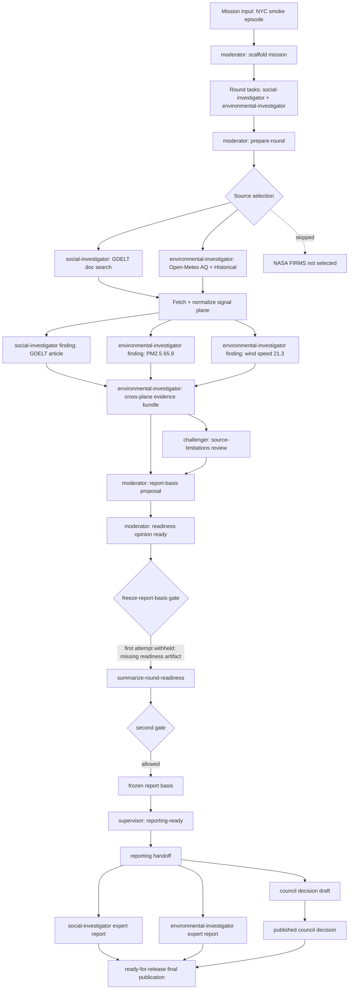
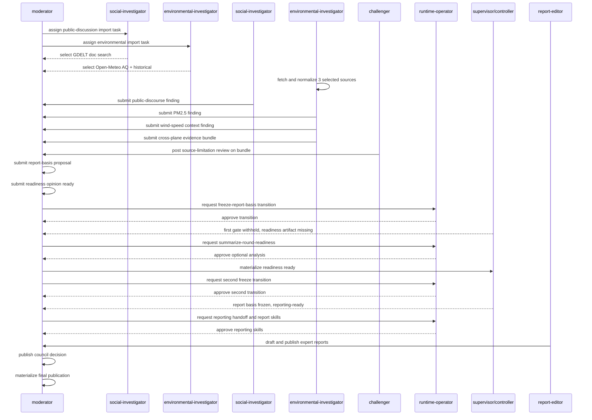

# OpenClaw 第一次真实案例测试结果时间线

测试对象：`runs/openclaw-realcase-nyc-smoke-20230607`

案例主题：`New York City wildfire smoke episode, June 2023`

运行窗口：`2023-06-07T00:00:00Z` 至 `2023-06-10T00:00:00Z`

执行时间：`2026-05-07T08:46:57Z` 至 `2026-05-07T09:05:36Z`

说明：本文按运行产物中的 UTC 时间整理。主要依据包括 `runtime/audit_ledger.jsonl`、`analytics/signal_plane.sqlite`、`deliberation/`、`evidence/`、`discussion/`、`report_basis/` 和 `reporting/` 下的最终产物。

文档性质：本文是第一次真实 run 的历史运行记录，不是开发工作计划，也不是当前系统能力基线。后续动态多轮调查治理以 `docs/openclaw-dynamic-investigation-planning-workplan.md` 为准；本文只用于保留当次运行事实、边界和暴露问题。

## 1. 总体结论

第一次真实案例测试在当时链路下跑通了一个受治理的端到端流程：mission scaffold、source planning、真实数据拉取、归一化、agent finding、challenger review、council proposal、readiness opinion、report-basis freeze、reporting handoff、expert reports、council decision、final publication。

最终产物是 `reporting/final_publication_round-001.json`，状态为：

- `publication_status=ready-for-release`
- `publication_posture=release`
- `publication_id=final-publication-1c29b173f34f`

但本轮实质上完成的是一个“有边界的证据基础报告”，不是完整的纽约烟霾事件归因调查。它只支持以下受限结论：

- GDELT 返回了与纽约烟霾事件相关的公开报道信号。
- Open-Meteo 返回了纽约附近 `2023-06-07T17:00` 的 PM2.5 modelled signal，数值为 `65.9 μg/m³`。
- Open-Meteo Historical 返回了纽约附近 `2023-06-07T22:00` 的风速 context signal，数值为 `21.3 km/h`。
- 这些信号可以支撑“纽约本地烟霾事件存在公开报道、空气质量观测和天气上下文”的描述。

它没有验证：

- 烟霾源区是否来自加拿大火点。
- 火点、烟羽、轨迹或输送路径。
- 风向和污染物变化之间的传输关系。
- 暴露、健康影响和应对建议。
- 政策建议的证据绑定。

## 2. Council Agent 与 Runtime Principal 分工

本节显式区分概念模型和代码角色模型：`runtime` 是维持议会可运行、可编排、可审计的框架，不是 agent；`runtime-operator` 是代码里的审批/审计主体，不参与 council reasoning；`moderator` 才是议会的实际组织者。表格继续保留 `runtime-operator`，是因为运行产物和 ledger 需要记录它作为 `actor_role` 的授权动作。

| 概念层级 | 代码角色/主体 | 本轮实际动作 | 输出或影响 |
| --- | --- | --- | --- |
| council agent | `moderator` | 搭建 mission、准备 round、提交 council proposal、提交 readiness opinion、请求 transition 和 reporting skill approval、起草并发布 council decision、生成 final publication | 负责把议会议题从任务编排推到报告发布，是本轮议会组织者 |
| runtime principal | `runtime-operator` | 审批 freeze-report-basis transition、审批 optional-analysis/reporting skills、监督 runtime gate | 作为治理和发布权限控制者，只授权程序性动作 |
| council agent | `social-investigator` | 获得 public/formal/social source selection，查询 GDELT normalized public signals，提交 public-discourse finding | 提供公开报道、社区表达、正式记录和政策材料证据入口 |
| council agent | `environmental-investigator` | 获得 environment source selection，执行 normalize、查询 PM2.5 和风速 signals、提交两个 environment findings、打包 cross-plane evidence bundle | 提供环境观测与上下文证据 |
| council agent | `challenger` | 对 evidence bundle 提出 scope/source review | 要求报告必须保留来源限制，不能把风速当作输送归因 |
| council agent | `report-editor` | 生成并发布 social/environmental expert reports | 把 reporting handoff 转成角色报告 |
| runtime controller | `round-controller` / `supervisor` | 执行 gate/controller/supervisor 状态传播 | 决定是否 hold investigation open 或 reporting-ready，是 runtime 状态机而非议会 agent |

最新架构不再保留历史 `sociologist`、`public-discourse-investigator` 或 `formal-record-investigator` 作为 agent 入口；这些来源和政策/正式记录职责统一由 `social-investigator` 承担。

## 3. 关键数据结果

归一化数据进入 `analytics/signal_plane.sqlite` 后的数量：

| source skill | plane | 记录数 |
| --- | --- | ---: |
| `fetch-gdelt-doc-search` | `public` | 50 |
| `fetch-open-meteo-air-quality` | `environment` | 288 |
| `fetch-open-meteo-historical` | `environment` | 291 |

Open-Meteo air quality 中各变量均覆盖 `2023-06-07T00:00` 至 `2023-06-09T23:00`，每个 hourly metric 72 条。PM2.5 范围为 `9.2` 至 `99.9 μg/m³`。

Open-Meteo historical 中 `wind_speed_10m` 范围为 `3.5` 至 `21.3 km/h`。但本轮没有把风速与烟羽轨迹、风向序列、上游火点或烟雾产品联立，因此只能作为本地 weather context。

## 4. 按时间顺序的完整过程

### 4.1 Mission 和任务生成

| 时间 | 事件 | Agent / 角色 | 行动 | 结论和理由 | 交互 |
| --- | --- | --- | --- | --- | --- |
| 08:46:57 | `scaffold-mission-run` | `moderator` | 从 `inputs/mission.json` 生成 `mission.json`、round tasks、board state 和 scaffold artifact | 生成 2 个任务、1 个 seeded hypothesis、3 个 source requests | moderator 把用户定义的真实案例 mission 转成 council 可执行 run |
| 08:46:57 | mission materialized | `moderator` | 固化目标：调查 June 2023 NYC smoke episode 的公开报道和环境观测，产出 DB-backed report | seeded hypothesis 是“公开报道和环境观测可能提供 bounded evidence basis” | 这里已经把问题框定为“证据基础是否足够”，不是完整源区/输送归因 |
| 08:46:57 | round tasks | `moderator` | 给 `social-investigator` 分配 public-discussion import 任务，给 `environmental-investigator` 分配 environment import 任务 | social-investigator 需要 normalize public artifacts；environmental-investigator 需要 normalize environmental artifacts | 两个角色从 mission/source requests 接任务 |
| 08:47:14 | `prepare-round` | `moderator` | 生成 `runtime/fetch_plan_round-001.json` | 计划 3 个 source steps：GDELT doc search、Open-Meteo air quality、Open-Meteo historical | fetch plan 消费 source selections 和 round tasks |

任务文件中两个任务的重点：

- `task-social-investigator-round-001-01`: 导入和归一化 public-discussion artifacts。
- `task-environmental-investigator-round-001-01`: 导入和归一化 environmental observation artifacts。

### 4.2 Source selection

| 角色 | 选中的 source | 跳过的关键 source | 选择理由或表现 |
| --- | --- | --- | --- |
| `social-investigator` | `fetch-gdelt-doc-search` | Bluesky、GDELT events、GDELT mentions、GDELT GKG、YouTube、Regulations.gov | `fetch-gdelt-doc-search` 被标记为 selected；其他均为 not selected |
| `environmental-investigator` | `fetch-open-meteo-air-quality`、`fetch-open-meteo-historical` | AirNow、OpenAQ、NASA FIRMS、Open-Meteo flood、USGS Water | Open-Meteo air-quality 和 historical 被 selected；`fetch-nasa-firms-fire` 存在于 allowed sources 但被 `selected=false` |

关键含义：NASA FIRMS 火点能力不是缺失，而是没有被本轮 mission/source requests 激活。source_requests 实际成为本轮调查议程，所以后续没有加拿大火点、烟羽或轨迹证据。

### 4.3 Fetch 和 normalize

| 时间 | 事件 | Agent / 角色 | 行动 | 结论和理由 | 交互 |
| --- | --- | --- | --- | --- | --- |
| 08:47:27 | `normalize-fetch-execution` preflight blocked | `runtime-operator` | 尝试以 operator 身份执行 normalize | 被 contract preflight 阻断，原因是 `runtime-operator` 缺少 `normalize` capability | 该阻断本身正确；暴露的问题是 registry 曾错误暴露 operator 可执行入口 |
| 08:47:44 - 08:47:56 | detached fetch | source runner | 执行 `fetch-gdelt-doc-search` | 成功写入 `raw/round-001/01-fetch-gdelt-doc-search.json` | 供 public-discourse investigator 后续查询 |
| 08:47:56 - 08:47:58 | detached fetch | source runner | 执行 `fetch-open-meteo-air-quality` | 成功写入 `raw/round-001/02-fetch-open-meteo-air-quality.json` | 供 environmental investigator 查询 |
| 08:47:58 - 08:48:00 | detached fetch | source runner | 执行 `fetch-open-meteo-historical` | 成功写入 `raw/round-001/03-fetch-open-meteo-historical.json` | 供 environmental investigator 查询 |
| 08:47:44 - 08:48:00 | `normalize-fetch-execution` | `environmental-investigator` | 执行队列 runner 和 normalizer runner | 3 个 fetch 全部 completed，failed_count=0 | 这一步也暴露越权：environmental-investigator 执行了 social-investigator 的 public fetch/normalize step |

本阶段结果：

- `completed_count=3`
- `failed_count=0`
- `normalized_signals=629`
- `normalized_signal_index=1158`
- runtime health 最终仍记录 1 个 blocked event 和 1 个 open dead letter。

### 4.4 查询和 finding 提交

| 时间 | 事件 | Agent / 角色 | 行动 | 结论 | 给出的理由 |
| --- | --- | --- | --- | --- | --- |
| 08:48:23 | `query-public-signals` | `social-investigator` | 查询 GDELT public signals | 返回 public article signal，例如 `sig-4a069678f7f5e5c6` | 后续用于 public-discourse finding |
| 08:48:36 | `query-environment-signals` | `environmental-investigator` | 查询 air-quality signal | 返回 `sig-03853ba4e8291c60`，PM2.5 `12.5 μg/m³` at `2023-06-09T23:00` | 探查 air quality 记录 |
| 08:48:47 | `query-environment-signals` | `environmental-investigator` | 查询 historical weather signal | 返回 `sig-110a90c0eb55d432`，wind speed `19.2 km/h` at `2023-06-09T23:00` | 探查 weather context |
| 08:49:00 | `query-environment-signals` | `environmental-investigator` | 查询 PM2.5 更高值 | 返回 `sig-89e30f31ef68ecbc`，PM2.5 `99.9 μg/m³` at `2023-06-08T00:00` | 探查空气质量峰值 |
| 08:50:31 | `query-environment-signals` | `environmental-investigator` | 查询 wind-speed context | 返回 `sig-1ab3967fdada5a7e`，wind speed `12.8 km/h` at `2023-06-08T00:00` | 探查天气上下文 |
| 08:51:07 | `finding-record-submitted` | `social-investigator` | 提交 `finding-4a09ef59410d` | GDELT corpus 中有报道 `"NY air quality : How asthma ER visits spiked amid wildfire smoke"`，发布时间 `20230609T230000Z` | 限于 item-level GDELT signal，不声称代表性、因果或政策方向；confidence `0.78` |
| 08:51:25 | `finding-record-submitted` | `environmental-investigator` | 提交 `finding-2d51e4948bbd` | Open-Meteo modelled PM2.5 signal 在 NYC 附近 `2023-06-07T17:00` 为 `65.9 μg/m³` | 描述性信号，不能单独证明暴露、源归因或健康影响；confidence `0.82` |
| 08:51:48 | `finding-record-submitted` | `environmental-investigator` | 提交 `finding-b013c41ea91c` | Open-Meteo historical wind_speed_10m 在 NYC 附近 `2023-06-07T22:00` 为 `21.3 km/h` | 只是 reanalysis-or-model weather context，不证明烟霾输送或因果机制；confidence `0.75` |

### 4.5 Evidence bundle 和 Challenger review

| 时间 | 事件 | Agent / 角色 | 行动 | 结论 | 给出的理由 | 交互 |
| --- | --- | --- | --- | --- | --- | --- |
| 08:52:14 | `evidence-bundle-submitted` | `environmental-investigator` | 提交 `evidence-bundle-86b2ed098ef5` | 将 1 个 public-report signal、1 个 PM2.5 signal、1 个 weather-context signal 打包成 cross-plane evidence bundle | 每个 item 都有 normalized signal evidence ref；bundle 保留 source limitations，不增加 causal attribution | environmental-investigator 消费 public finding 和 environment findings，形成跨平面 bundle |
| 08:52:30 | `review-comment-posted` | `challenger` | 对 bundle 发出 `review-comment-17b29c761540` | 报告必须带入来源限制：GDELT 不代表公众意见，Open-Meteo PM2.5 是 modelled-air-quality，weather context 不能当作 transport attribution | `report_risk=source-limitations`，状态 `open` | challenger 响应 evidence bundle，给后续报告设置 caveat |

challenger 的评论是本轮最关键的 agent-to-agent 约束。它没有阻止继续报告，但明确要求报告不得把有限证据扩展成源归因、传输归因或代表性舆情结论。

### 4.6 Council proposal、readiness opinion 和第一次 freeze 尝试

| 时间 | 事件 | Agent / 角色 | 行动 | 结论 | 给出的理由 | 交互 |
| --- | --- | --- | --- | --- | --- | --- |
| 08:53:21 | `submit-council-proposal` | `moderator` | 提交 `proposal-14846be19b9a` | 建议只冻结该 bounded evidence bundle，并把 source limitations 带入报告 | bundle 有 item-level public、PM2.5、weather-context refs，并已有 challenger review | moderator 以 bundle 和 challenger review 为 lineage |
| 08:53:40 | `submit-readiness-opinion` | `moderator` | 提交 `readiness-opinion-c4fbe5906b59` | `readiness_status=ready` | 因为 evidence bundle、source-limitation review 和 report-basis proposal 都已存在；ready 只限于带 caveat 报告这些 records | moderator 明确限制报告边界 |
| 08:55:56 | `transition-request` | `moderator` | 请求 `freeze-report-basis` | 请求冻结 bounded report basis | transition 不增加政策方向，也不修改 council conclusions | moderator 请求 operator 审批 |
| 08:56:05 | `transition-approval` | `runtime-operator` | 审批第一次 freeze request | `approved` | 只授权治理 transition，不指挥报告结论 | runtime-operator 作为治理权限方批准 |
| 08:58:47 | `report-basis-gate` | runtime gate | 执行第一次 gate | `report-basis-freeze-withheld`，`readiness_status=blocked` | 当时缺少 materialized round readiness artifact | gate 阻断后续 freeze |
| 08:58:47 | `freeze-report-basis` | `moderator` | 第一次 freeze skill 执行 | 产物写出但 basis 后续被视为 withheld/不充分 | gate withheld，controller 和 supervisor 不进入 reporting-ready | 触发后续 readiness materialization |
| 08:58:47 | `round-controller` | `runtime-operator` | 汇总 controller 状态 | `controller_status=completed`，但 `report_basis_status=withheld` | gate withheld | controller 记录 investigation 仍不能交给 reporting |
| 08:58:47 | `supervisor` | supervisor | 汇总 supervisor 状态 | `supervisor_status=hold-investigation-open` | blockers: `report-basis-withheld`、`readiness-blocked`、`supervisor-investigation-open` | supervisor 阻止 reporting-ready |

这一步暴露了一个流程缺口：已有 readiness opinion，但 gate 需要 DB-backed/materialized `round_readiness_round-001.json`，否则会把 readiness 判为 blocked。

### 4.7 生成 readiness artifact 并第二次 freeze

| 时间 | 事件 | Agent / 角色 | 行动 | 结论 | 给出的理由 | 交互 |
| --- | --- | --- | --- | --- | --- | --- |
| 09:00:33 | `skill-approval-request` | `moderator` | 请求运行 `summarize-round-readiness` | 需要从现有 DB-backed council state 生成 readiness assessment artifact | 第一次 gate 报告缺少 round readiness artifact | moderator 请求 operator 批准 optional analysis |
| 09:00:42 | `skill-approval` | `runtime-operator` | 审批 `summarize-round-readiness` | `approved` | 只用于 materialize governed readiness assessment | operator 批准程序性分析 |
| 09:00:50 | `summarize-round-readiness` | `moderator` | 生成 `reporting/round_readiness_round-001.json` | `readiness_status=ready` | board posture 无 open challenges/tasks，investigation posture 无 recorded gaps | readiness artifact 被写入 DB 和 reporting 目录 |
| 09:01:01 | `transition-request` | `moderator` | 请求重跑 `freeze-report-basis` gate | 要求 gate 重新评估已有 council records | 此时 round readiness 已 materialized ready | moderator 再次请求 operator 批准 |
| 09:01:10 | `transition-approval` | `runtime-operator` | 审批第二次 freeze request | `approved` | 同意在 readiness artifact 生成后重跑 freeze gate | operator 审批治理 transition |
| 09:01:17 | `supervisor` | supervisor | 第二次 freeze 前刷新 supervisor | 仍为 `hold-investigation-open` | gate 尚未重跑成功，仍有 withheld/blocker 状态 | supervisor 状态短暂滞后 |
| 09:01:27 | `report-basis-gate` | runtime gate | 重跑 gate | `report-basis-freeze-allowed`，`readiness_status=ready` | 1 个 council proposal 支持 freeze，1 个 readiness opinion 支持 freeze，且 current gate 允许 | gate 接受 moderator 的 bounded report 口径 |
| 09:01:27 | `freeze-report-basis` | `moderator` | 生成最终 `report_basis/frozen_report_basis_round-001.json` | `report_basis_status=frozen`，`basis_id=report-basis-27417982b73b` | report basis resolution mode 为 `gate-passed-with-council-support` | freeze 消费 proposal 和 readiness opinion |
| 09:01:27 | `round-controller` | `runtime-operator` | 汇总 controller 状态 | `controller_status=completed`，`report_basis_status=frozen` | gate allowed | controller 允许进入 reporting |
| 09:02:19 | `supervisor` | supervisor | 刷新 supervisor 状态 | `supervisor_status=reporting-ready`，`reporting_ready=true` | 无 reporting blockers | supervisor 给 reporting handoff 开门 |

最终 frozen report basis 的一个重要问题：

- `selected_evidence_refs` 只有 PM2.5 证据 ref。
- 但 handoff/final evidence index 又包含 3 个 findings、1 个 bundle、proposal、readiness opinion、review comment 等上下文。

这造成“冻结证据”和“报告候选证据”之间的边界不够清晰。

### 4.8 Reporting handoff

| 时间 | 事件 | Agent / 角色 | 行动 | 结论 | 给出的理由 | 交互 |
| --- | --- | --- | --- | --- | --- | --- |
| 09:01:56 | `skill-approval-request` | `moderator` | 请求 `materialize-reporting-handoff` | 从 frozen report basis 生成 reporting handoff | 下游报告只能引用 governed records | moderator 请求 operator 批准 reporting skill |
| 09:02:04 | `skill-approval` | `runtime-operator` | 审批 handoff | `approved` | 从 frozen report basis 和 DB-backed records materialize handoff | operator 批准 |
| 09:02:10 - 09:02:11 | `materialize-reporting-handoff` | `moderator` | 第一次生成 `reporting_handoff_round-001.json` | finding_count=3 | 消费 report-basis、bundle、review、readiness | 形成报告输入 |
| 09:02:31 | `skill-approval-request` | `moderator` | 请求重新 materialize handoff | supervisor 已刷新为 reporting-ready，需要更新 handoff | 使用同一个 frozen report basis 和现有 records | moderator 请求 operator 再批准 |
| 09:02:40 | `skill-approval` | `runtime-operator` | 审批重跑 handoff | `approved` | supervisor state 已变成 reporting-ready | operator 批准 |
| 09:02:47 - 09:02:48 | `materialize-reporting-handoff` | `moderator` | 最终 handoff 写入 | `handoff_status=reporting-ready`，`reporting_ready=true` | report_basis frozen，readiness ready，supervisor reporting-ready | 作为 council decision 和 expert reports 的输入 |

handoff 的结果与风险：

- `key_findings=3`，包括风速、PM2.5、GDELT article。
- `policy_recommendations` 是 generic reporting/audit actions，不是环境政策建议。
- `open_risks` 错把一些正向 operator notes 和 gate reasons 作为 open risks，例如“round explicitly ready”和“council submitted 1 readiness opinions”。
- `recommended_next_actions` 又要求 moderator resolve/carry forward 这些 open risks，和 `reporting_ready=true` 存在语义冲突。

### 4.9 Council decision 和 expert reports

| 时间 | 事件 | Agent / 角色 | 行动 | 结论 | 给出的理由 | 交互 |
| --- | --- | --- | --- | --- | --- | --- |
| 09:03:05 | `skill-approval-request` | `moderator` | 请求 `draft-council-decision` | 从 reporting-ready handoff 和 frozen report basis 起草 decision | 保留 source limitations 和 evidence refs | moderator 请求 operator 审批 |
| 09:03:12 | `skill-approval` | `runtime-operator` | 审批 council decision draft | `approved` | 允许从 reporting-ready handoff 起草 | operator 批准 |
| 09:03:19 | `draft-council-decision` | `moderator` | 生成 `council_decision_draft_round-001.json` | `publication_readiness=ready`，`moderator_status=finalize` | 认为 round ready for formal reporting and decision finalization | 消费 handoff 和 report basis |
| 09:03:33 | `draft-expert-report` | `report-editor` | 生成 social-investigator draft | `status=ready-to-publish` | public discourse/community impact section | 但 finding list 仍包含 3 个 findings，包括环境证据 |
| 09:03:39 | `draft-expert-report` | `report-editor` | 生成 environmental-investigator draft | `status=ready-to-publish` | environmental evidence/risk section | 同样包含 3 个 findings |
| 09:04:02 | `skill-approval-request` | `moderator` | 请求发布 social-investigator expert report | 从 ready draft 发布 canonical report | 保留 frozen evidence basis 和 source limitations | moderator 请求 report-editor 执行、operator 审批 |
| 09:04:09 | `skill-approval` | `runtime-operator` | 审批 social-investigator report 发布 | `approved` | 允许发布 ready draft | operator 批准 |
| 09:04:19 | `publish-expert-report` | `report-editor` | 发布 social-investigator canonical report | `expert-report-social-investigator-round-001` | publication_readiness ready | canonical report 中 `handoff_status=investigation-open`、`reporting_ready=false`，与发布状态不一致 |
| 09:04:28 | `skill-approval-request` | `moderator` | 请求发布 environmental-investigator expert report | 从 ready draft 发布 canonical report | 保留 frozen evidence basis 和 source limitations | moderator 请求 report-editor 执行、operator 审批 |
| 09:04:36 | `skill-approval` | `runtime-operator` | 审批 environmental-investigator report 发布 | `approved` | 允许发布 ready draft | operator 批准 |
| 09:04:42 | `publish-expert-report` | `report-editor` | 发布 environmental-investigator canonical report | `expert-report-environmental-investigator-round-001` | publication_readiness ready | canonical report 同样出现 `handoff_status=investigation-open`、`reporting_ready=false` |
| 09:04:52 | `skill-approval-request` | `moderator` | 请求发布 council decision | 两个 expert reports 已发布 | 以 ready draft 发布 canonical decision | moderator 请求 operator 审批 |
| 09:05:00 | `skill-approval` | `runtime-operator` | 审批 council decision 发布 | `approved` | expert reports 已发布 | operator 批准 |
| 09:05:07 | `publish-council-decision` | `moderator` | 发布 `council_decision_round-001.json` | canonical council decision | decision summary 使用风速 finding 作为 lead basis | 形成 final publication 的主决策输入 |

Council decision 的关键结论：

- `decision_summary`: round ready for formal reporting and decision finalization。
- lead basis 被写成风速 context finding：`wind_speed_10m of 21.3 km/h`。
- `next_round_required=false`。
- `publication_readiness=ready`。

这里存在一个结果质量问题：风速 context 被任意拿成 lead basis，但 challenger 已明确警告 weather context 不应当被当成 transport attribution。虽然 decision summary 没有直接声称 transport causality，但以风速作为 lead basis 容易误导。

### 4.10 Final publication

| 时间 | 事件 | Agent / 角色 | 行动 | 结论 | 给出的理由 | 交互 |
| --- | --- | --- | --- | --- | --- | --- |
| 09:05:16 | `skill-approval-request` | `moderator` | 请求 `materialize-final-publication` | 从 canonical council decision 和 published expert reports 生成 final package | basis objects 包括 council decision、两个 expert reports、report basis | moderator 请求 operator 审批 |
| 09:05:27 | `skill-approval` | `runtime-operator` | 审批 final publication | `approved` | 允许从 canonical artifacts materialize final publication | operator 批准 |
| 09:05:36 | `materialize-final-publication` | `moderator` | 生成 `final_publication_round-001.json` | `ready-for-release` / `release` | decision、expert reports、frozen report basis 均存在 | final publication 汇总所有报告产物 |

Final publication 包含：

- 10 个 published sections。
- 2 个 role reports。
- 3 个 key findings。
- 1 个 council decision。
- 1 个 frozen report basis。
- 1 个 evidence bundle、1 个 challenger review、1 个 readiness opinion、1 个 proposal 进入 evidence index/audit context。

Final publication 同时保留了几个不一致点：

- `publication_status=ready-for-release`，但 `open_risks` 仍有 4 条。
- `residual_disputes` 仍把正向 gate/operator notes 作为 open disputes。
- `policy_recommendations` 是 draft/reporting/audit 动作，不是证据绑定的环境或公共健康建议。
- `selected_evidence_refs` 只有 PM2.5 ref，但 final evidence index 包含更多候选证据。
- expert canonical reports 里有 stale status：`handoff_status=investigation-open`、`reporting_ready=false`。

## 5. Ledger 事件索引

本轮 `audit_ledger.jsonl` 共 58 个事件。下表按 event number 压缩列出完整运行链路：

| # | 时间 | 类型 / skill | 角色 | 状态 | 结果 |
| ---: | --- | --- | --- | --- | --- |
| 1 | 08:46:57 | `skill-execution` / `scaffold-mission-run` | `moderator` | completed | 生成 mission scaffold、2 tasks、1 hypothesis、3 source requests |
| 2 | 08:47:14 | `skill-execution` / `prepare-round` | `moderator` | completed | 生成 3-step fetch plan |
| 3 | 08:47:27 | `skill-preflight` / `normalize-fetch-execution` | `runtime-operator` | blocked | operator 被正确挡在数据执行层之外，产生 dead letter |
| 4 | 08:47:44 - 08:47:56 | `detached-fetch-execution` / `fetch-gdelt-doc-search` | source runner | completed | GDELT raw artifact written |
| 5 | 08:47:56 - 08:47:58 | `detached-fetch-execution` / `fetch-open-meteo-air-quality` | source runner | completed | Open-Meteo AQ raw artifact written |
| 6 | 08:47:58 - 08:48:00 | `detached-fetch-execution` / `fetch-open-meteo-historical` | source runner | completed | Open-Meteo Historical raw artifact written |
| 7 | 08:47:44 - 08:48:00 | `skill-execution` / `normalize-fetch-execution` | `environmental-investigator` | completed | 3 sources normalized；其中 public step 不应由 environmental role 执行 |
| 8 | 08:48:23 | `query-public-signals` | `social-investigator` | completed | 查询 public signals |
| 9 | 08:48:36 | `query-environment-signals` | `environmental-investigator` | completed | 查询 PM2.5 signal |
| 10 | 08:48:47 | `query-environment-signals` | `environmental-investigator` | completed | 查询 wind_speed signal |
| 11 | 08:49:00 | `query-environment-signals` | `environmental-investigator` | completed | 查询 PM2.5 peak/context |
| 12 | 08:50:31 | `query-environment-signals` | `environmental-investigator` | completed | 查询 wind_speed context |
| 13 | 08:51:07 | `finding-record-submitted` | `social-investigator` | completed | 提交 GDELT public article finding |
| 14 | 08:51:25 | `finding-record-submitted` | `environmental-investigator` | completed | 提交 PM2.5 finding |
| 15 | 08:51:48 | `finding-record-submitted` | `environmental-investigator` | completed | 提交 wind-speed context finding |
| 16 | 08:52:14 | `evidence-bundle-submitted` | `environmental-investigator` | completed | 提交 cross-plane evidence bundle |
| 17 | 08:52:30 | `review-comment-posted` | `challenger` | completed | 提交 source-limitations review |
| 18 | 08:53:21 | `submit-council-proposal` | `moderator` | completed | 提交 bounded report-basis freeze proposal |
| 19 | 08:53:40 | `submit-readiness-opinion` | `moderator` | completed | 提交 `readiness_status=ready` opinion |
| 20 | 08:55:56 | `transition-request` | `moderator` | completed | 请求第一次 freeze-report-basis |
| 21 | 08:56:05 | `transition-approval` | `runtime-operator` | completed | 批准第一次 freeze transition |
| 22 | 08:58:47 | `report-basis-gate` | runtime gate | completed | gate withheld，readiness blocked |
| 23 | 08:58:47 | `freeze-report-basis` | `moderator` | completed | freeze 产物写出但 gate withheld |
| 24 | 08:58:47 | `round-controller` | `runtime-operator` | completed | controller completed，basis withheld |
| 25 | 08:58:47 | `supervisor` | supervisor | completed | hold-investigation-open |
| 26 | 09:00:33 | `skill-approval-request` / `summarize-round-readiness` | `moderator` | completed | 请求 materialize readiness artifact |
| 27 | 09:00:42 | `skill-approval` / `summarize-round-readiness` | `runtime-operator` | completed | 批准 optional-analysis |
| 28 | 09:00:50 | `summarize-round-readiness` | `moderator` | completed | readiness ready |
| 29 | 09:01:01 | `transition-request` | `moderator` | completed | 请求第二次 freeze-report-basis |
| 30 | 09:01:10 | `transition-approval` | `runtime-operator` | completed | 批准第二次 freeze transition |
| 31 | 09:01:17 | `supervisor` | supervisor | completed | 仍 hold-investigation-open |
| 32 | 09:01:27 | `report-basis-gate` | runtime gate | completed | gate allowed，readiness ready |
| 33 | 09:01:27 | `freeze-report-basis` | `moderator` | completed | frozen report basis `report-basis-27417982b73b` |
| 34 | 09:01:27 | `round-controller` | `runtime-operator` | completed | controller completed，basis frozen |
| 35 | 09:01:56 | `skill-approval-request` / `materialize-reporting-handoff` | `moderator` | completed | 请求 reporting handoff |
| 36 | 09:02:04 | `skill-approval` / `materialize-reporting-handoff` | `runtime-operator` | completed | 批准 handoff |
| 37 | 09:02:10 - 09:02:11 | `materialize-reporting-handoff` | `moderator` | completed | handoff generated，finding_count=3 |
| 38 | 09:02:19 | `supervisor` | supervisor | completed | reporting-ready |
| 39 | 09:02:31 | `skill-approval-request` / `materialize-reporting-handoff` | `moderator` | completed | 请求刷新 handoff |
| 40 | 09:02:40 | `skill-approval` / `materialize-reporting-handoff` | `runtime-operator` | completed | 批准刷新 handoff |
| 41 | 09:02:47 - 09:02:48 | `materialize-reporting-handoff` | `moderator` | completed | final handoff reporting-ready |
| 42 | 09:03:05 | `skill-approval-request` / `draft-council-decision` | `moderator` | completed | 请求 draft council decision |
| 43 | 09:03:12 | `skill-approval` / `draft-council-decision` | `runtime-operator` | completed | 批准 decision draft |
| 44 | 09:03:19 | `draft-council-decision` | `moderator` | completed | council decision draft ready |
| 45 | 09:03:33 | `draft-expert-report` | `report-editor` | completed | social-investigator draft ready |
| 46 | 09:03:39 | `draft-expert-report` | `report-editor` | completed | environmental-investigator draft ready |
| 47 | 09:04:02 | `skill-approval-request` / `publish-expert-report` | `moderator` | completed | 请求发布 social-investigator report |
| 48 | 09:04:09 | `skill-approval` / `publish-expert-report` | `runtime-operator` | completed | 批准 social-investigator report 发布 |
| 49 | 09:04:19 | `publish-expert-report` | `report-editor` | completed | social-investigator canonical report |
| 50 | 09:04:28 | `skill-approval-request` / `publish-expert-report` | `moderator` | completed | 请求发布 environmental-investigator report |
| 51 | 09:04:36 | `skill-approval` / `publish-expert-report` | `runtime-operator` | completed | 批准 environmental-investigator report 发布 |
| 52 | 09:04:42 | `publish-expert-report` | `report-editor` | completed | environmental-investigator canonical report |
| 53 | 09:04:52 | `skill-approval-request` / `publish-council-decision` | `moderator` | completed | 请求发布 council decision |
| 54 | 09:05:00 | `skill-approval` / `publish-council-decision` | `runtime-operator` | completed | 批准 council decision 发布 |
| 55 | 09:05:07 | `publish-council-decision` | `moderator` | completed | canonical council decision |
| 56 | 09:05:16 | `skill-approval-request` / `materialize-final-publication` | `moderator` | completed | 请求 final publication |
| 57 | 09:05:27 | `skill-approval` / `materialize-final-publication` | `runtime-operator` | completed | 批准 final publication |
| 58 | 09:05:36 | `materialize-final-publication` | `moderator` | completed | final publication ready-for-release |

## 6. Agent 交互链

本轮交互可以归纳为 7 条链：

1. `moderator -> social-investigator/environmental-investigator`

   moderator 通过 mission scaffold 和 round tasks 将任务分给 social-investigator 与 environmental-investigator。任务没有要求源区归因或烟羽输送，只要求 public 和 environmental artifacts 的导入/归一化。

2. `social-investigator/source selection -> social-investigator`

   social-investigator 侧只选择 GDELT doc search。social-investigator 查询 GDELT normalized signals，并提交公开报道 finding。

3. `environmental-investigator/source selection -> environmental-investigator`

   environmental-investigator 侧只选择 Open-Meteo air quality 和 historical。environmental-investigator 完成 fetch normalization、查询 PM2.5 和 wind-speed signals，并提交两个 finding。

4. `social-investigator + environmental-investigator -> evidence bundle`

   environmental-investigator 把 public finding、PM2.5 finding、weather-context finding 组合为 cross-plane bundle。这个 bundle 是后续 proposal、readiness opinion、reporting handoff 的主要事实基础。

5. `challenger -> evidence bundle`

   challenger 对 bundle 发出 source-limitation review，明确要求报告不得把 GDELT 当代表性舆情，不得把 modelled PM2.5 当实测暴露，不得把 weather context 当烟霾输送归因。

6. `moderator -> runtime-operator`

   moderator 提交 proposal、readiness opinion、transition requests 和 reporting skill approval requests。runtime-operator 逐一审批 transition 和 reporting skills。operator 的作用是授权治理动作，不指挥报告结论。

7. `report-editor + moderator -> final publication`

   report-editor 生成并发布两个 expert reports；moderator 发布 council decision 并 materialize final publication。final publication 汇总所有 canonical reporting artifacts。

## 7. 流程图

### 7.1 运行主流程

### 7.2 Agent 交互序列

## 8. 本轮结果的边界和问题

### 8.1 成功之处

- 真实外部数据源被调用，且数据进入 DB-backed signal plane。
- 运行链路有 audit ledger、receipts、approval requests、approval consumptions，治理痕迹完整。
- agent findings 都带有 evidence refs、basis object ids、confidence、rationale。
- challenger 明确介入，并对 source limitations 做出约束。
- council proposal 和 readiness opinion 明确将报告限制在 bounded evidence basis。
- final publication 能够从 canonical decision 和 expert reports 组装出来。

### 8.2 主要缺口

- Mission 过窄：实际目标是“公开报道和环境观测是否足以形成 bounded report”，不是“完整调查纽约烟霾事件”。
- Source selection 过窄：source_requests 固定了议程，NASA FIRMS 虽可用但没有被选中。
- 缺少源区/输送证据：没有火点、烟羽、轨迹、上游区域、风向序列关联或 health/response evidence lane。
- Readiness gate 有物化依赖：已有 readiness opinion 仍不足以通过 gate，必须先生成 `round_readiness_round-001.json`。
- Reporting handoff 把正向 gate/operator notes 转成 open risks，造成 `reporting_ready=true` 与 `open_risks` 并存。
- Council decision 任意选择 wind-speed finding 作为 lead basis，容易放大天气上下文的重要性。
- Expert reports 角色过滤不足：social-investigator report 也继承了 environmental findings。
- Final publication 门禁偏松：存在 open risks、residual disputes、stale expert report status 时仍 `ready-for-release`。

## 9. 可引用的本轮最终判断

如果要概括本轮测试结果，可以使用下面这段：

> 本轮真实案例 run 成功证明了 OpenClaw 可以完成从 mission、真实数据拉取、DB-backed evidence、challenger review、council governance 到 final publication 的端到端链路。但由于 mission 和 source selection 把问题限制在 GDELT 公开报道、Open-Meteo PM2.5 与本地历史天气上下文，系统最终只形成了一个有边界的证据基础报告。它没有完成纽约 2023 年 6 月烟霾事件的源区归因、烟羽输送、健康影响或应对建议验证。报告链路还暴露了 readiness gate、角色能力、reporting handoff 风险传播、expert report 状态传播和 final publication 门禁偏松等治理问题。
